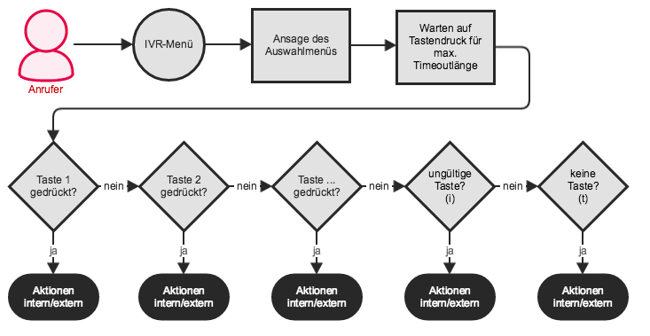


 


## Konzept

Auswahlmenüs (IVR) dienen dazu den Anrufer durch das Drücken einer Taste durch das Telefonsystem zu lenken. Beispielsweise kann es sein, dass 50% der Anrufer auf der Zentrale nur entweder mit dem Vertrieb oder dem Support verbunden werden möchten. Hier kann man die [Telefonzentrale](https://www.pascom.net/de/voip-telefonanlage "Telefonzentrale") sinnvoll entlasten indem man ein Auswahlmenü vor die Zentrale schaltet.

Dies kann dem Anrufer dann anbieten:

> "Drücken Sie die **1** für den **Vertrieb** die **2** für den **Support**. Treffen Sie **keine Auswahl** werden Sie automatisch mit der **Telefonzentrale** verbunden ..."

### Ablauf eines Auswahlmenüs

Wird ein IVR Menü gerufen findet folgender Ablauf statt:

Zuerst spielt ein IVR-Menü eine [Ansage Ihrer Wahl]() ab. Diese Ansage beinhaltet beispielsweise den Text:

> "Drücken Sie die 1 für den Vertrieb die 2 für den Support. Treffen Sie keine Auswahl werden Sie automatisch mit der Telefonzentrale verbunden ...".

Danach wartet das System den von Ihnen im IVR Menü definierten **Timeout** lang auf einen Tastendruck des Anrufers. Ein 5 Sekunden Timeout hat sich hier als praktikabel erwiesen.

Hat der Anrufer eine Taste gedrückt, für die ein **Eintrag vorhanden** ist, werden die Aktionen ausgeführt die dort hinterlegt sind.

Drückt der Anrufer eine Taste für die **kein Eintrag vorhanden** ist, wird automatisch der Eintrag mit der Sondernummer i (für *invalid*) gerufen. In den hier hinterlegten Aktionen ist es sinnvoll den Anrufer darauf hinzuweisen, dass er eine falsche Taste gedrückt hat und ihn wieder auf das selbe IVR abzuwerfen um ihm erneut die Auswahlmöglichkeiten vorzulesen.

Drückt der Anrufer innerhalb des Timeouts **keine Taste** wird automatisch der Eintrag mit der Sondernummer t (für *timeout*) gerufen. In den hier hinterlegten Aktionen ist es entweder sinnvoll den Anrufer darauf hinzuweisen, dass er keine Taste gedrückt hat und ihn wieder auf das selbe IVR abzuwerfen um ihm erneut die Auswahlmöglichkeiten vorzulesen oder den Anrufer z. B. auf die Zentrale abzuwerfen.

### Mehrstufige Auswahlmenüs

In machen Fällen ist es sinnvoll mehrere Fragen hintereinander zu stellen um den Anrufer mit dem gewünschten Ziel zu verbinden. Beispielsweise können Sie einen Anrufer zuerst fragen ob er mit dem Support verbunden werden will und danach eine Supportkategorie (Probleme mit Windows, Linux, usw..) abfragen um ihn mit den richtigen Ansprechpartnern zu verbinden.

Hier können Sie einfach beliebig viele IVRs anlegen und einfach von einem in ein andres abwerfen. Somit ist eine beliebige Verschachtelung möglich.

{}
Vermeiden Sie wenn möglich mehr als zwei Ebenen. Stark verschachtelte Abfragemenüs werden i. d. R. vom Anrufer nicht akzeptiert.
{}

## Konfiguration
### IVR verwalten

Wählen Sie in der pascom Weboberfläche  > . Wenn Sie ein neues IVR hinzufügen möchten drücken Sie . Falls Sie ein bestehendes IVR bearbeiten wollen markieren Sie dies in der Liste und wählen .

|Parameter|Beschreibung|
|---|---|
|**Bezeichnung**|Allgemeine Bezeichnung des IVR Menüs.
|**Kanal beantworten**|Normalerweise wird der Kanal sofort beantwortet falls Wartemusik oder eine Ansage abgespielt werden soll. Dies kann man hier verzögern (in Millisekunden). Bei manchen Anrufern kommt es vor, dass bei einer sofortigen Beantwortung die erste Silbe der Ansage "verschluckt" wird. Durch eine Verzögerung kann dies vermieden werden.|
|**Timeout**|Wie lange wartet das System auf einen Tastendruck des Anrufers nachdem die Ansage vorgelesen wurde in Sekunden.
|**Durchwahl**|Die Durchwahl unter der dieses IVR erreichbar ist.|
|**Ansage vorschalten**|Diese Ansage wird beim Betreten des Menüs vorgelesen und sollte Text wie "Drücken Sie die 1 um ..., die 2 um ..., usw." enthalten.|

### Einträge erstellen

Wählen Sie in der pascom Weboberfläche  >  markieren Sie das gewünschte IVR und drücken Sie auf die Schaltfläche . Hier können Sie definieren was bei welchem Tastendruck passieren soll. Wählen Sie  um einen neuen Eintrag zu erstellen.

|Parameter|Bedeutung|
|---|---|
|**Bezeichnung**|Allgemeine Bezeichnung des Eintrages.|
|**Nummer**| Die Nummer die vom Anrufer per Telefontaste gedrückt wurde. Gültige Werte sind beliebige **Ziffern** oder **Ziffernfolgen**.  Die Sondernummern **t** für Timeout und **i** für ungültige Taste sind schon vordefiniert.  Um Überlappungen zu vermeiden verwenden Sie entweder einstellige, zweistellige, dreistellige, ... Nummern und mischen diese nicht.|

### Aktionen zum Eintrag hinterlegen

Jeder Eintrag braucht Aktionen die ausgeführt werden wenn die entsprechende Taste gedrückt wird.

Wählen Sie in der pascom Weboberfläche  >  markieren Sie das gewünschte IVR und drücken Sie auf die Schaltfläche . Wählen Sie den entsprechenden Eintrag und drücken . Im Reiter **Intern** und **Extern** finden Sie die Aktionen zum jeweiligen Eintrag.
