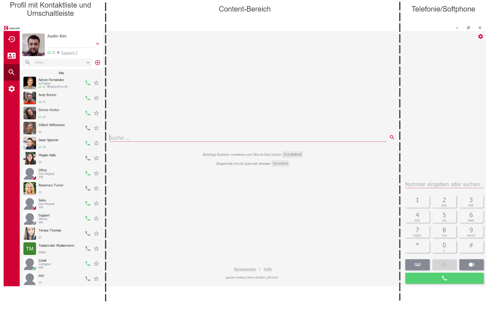
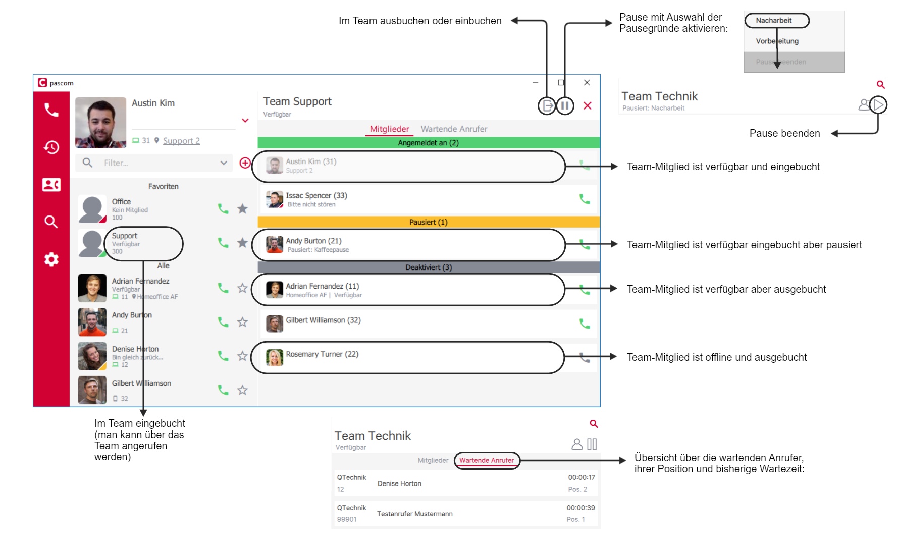


 


<!-- FIXME - bilder nur mit hellem theme! -->

<!--FIXME
- Amtsholung
- Hinweis auf unterstützte Headsets
- VErbinden -> Bilder mit einheitlichen Nummern
-->

## Übersicht

Der Client besteht aus drei grundsätzlichen Bereichen:

+ Der Bereich links beinhaltet das eigene Profil mit Kontaktliste und Umschaltleiste,
+ der Bereich links bietet die Telefonie-Funktion
+ und der mittlere Content-Bereich ist flexibel. Sie können über die rote Umschaltleiste Konversationen, Journal oder das Telefonbuch anzeigen lassen.

Die verschiedenen Ansicht-Möglichkeiten des Clients:

+ **Expanded Mode**: Alle drei Bereiche sind sichtbar, der mittlere Bereich kann über die Umschaltleiste ausgewählt werden.
+ **Normal Mode**: Es sind der Profil- und Kontakte-Bereich sichtbar, zusätzlich kann über die Umschaltleiste zwischen *Konversationen*, *Telefonie-Funktion*, *Journal* oder *Telefonbuch* gewählt werden.
+ **Mini Mode**: Es ist nur ein Bereich sichtbar, und die Umschaltleiste ist nun unten zu finden. Über diese kann zwischen den Bereichen gewechselt werden.

Zwischen den verschiedenen Ansichten können Sie wechseln, indem Sie die Größe des Clients ändern oder indem Sie [Tastenkürzel]() verwenden.

Im Folgenden werden die einzelnen Bereiche und Funktionen näher erklärt.

## Profil und Kontaktliste

Funktionen in der Kontaktliste:

|Funktion|Beschreibung|
|---|---|
|Profil- und Kontaktlisten-Einstellungen|Hier können Sie sich am Client abmelden und weitere Einstellungen vornehmen (siehe unten).|
|Verfügbarkeits-Status|Es stehen zur Auswahl: - *grün* > Verfügbar - *gelb* > Bin gleich zurück - *rot* > Bitte nicht stören (Diese Einstellung hat keine DND-Funktionalität.) Die Status-Texte können Sie nach Bedarf ändern.|
|Umschalter der Kontaktliste|Mit diesem Umschalter können Sie die Ansicht der Kontakte einstellen, *breit* mit Profil-Bild oder *schmal* ohne Profil-Bild.|
|Filter für Kontaktliste|Hier können Sie über Filter nur bestimme Kontakte anzeigen lassen. Zwei Filter sind standardmäßig schon vorhanden, *Favoriten* und *Team*. Die Favoriten können Sie selber definieren, mit einem Klick auf das Sternchen neben dem Hörer-Symbol. Weitere Filter werden von Ihrem Administrator über [Rollen]() festgelegt.|
|Kontakte|Hier erhalten Sie Informationen über Ihre [Kontakte]().|
|Teams|Hier sehen Sie die [Teams]() in denen Sie fester oder flexibler Mitglied sind. Der Status *Verfügbar* oder *Offline* bezieht sich in diesem Fall darauf, ob Sie eingebucht sind oder nicht.|

Profil- und Kontaktlisten-Einstellungen:

|Einstellung|Beschreibung|
|---|---|
|Profil|Im Bereich Profil können Sie ein Profil-Bild hinzufügen. Klicken Sie auf *Auswählen...* und wählen Sie ein Bild, das auf Ihrem Rechner gespeichert ist, aus. Alternativ können Sie auch eins *Generieren*.|
|Kontaktliste|Hier finden Sie Optionen zur Gestaltung Ihrer Kontaktliste.|
|Automatische Abwesenheit|Hier können Sie die automatische Abwesenheit aktivieren. Geben Sie die Zeit ein, nach der der Status auf gelb wechselt und Ihre Abwesenheitsnotiz angezeigt wird.|
|Passwort ändern|Falls Ihre Authentifizierung über die pascom erfolgt, können Sie mit dem Button *Passwort ändern* ein neues Passwort vergeben.|

## Kontakte

## Teams

## Integrates Softphone

Über die Einstellungen können Sie auch das pascom Softphone auswählen. Voraussetzung ist, dass Ihr Administrator Ihnen bereits ein integriertes Softphone zugewiesen hat.

Um das Softphone verwenden zu können, müssen Sie die passenden Softphone-Einstellungen vornehmen (Mikrofon und Lautsprecher auswählen). Auch wenn Ihr Client das Headset bereits erkannt hat, müssen Sie es explizit auswählen. Sollte das gewünschte Headset nicht automatisch in den Einstellungen erscheinen, müssen Sie ggf. die Audio-Einstellungen Ihrer Rechners prüfen.

## Telefonieren

Bevor Sie das erste Mal telefonieren, prüfen Sie bitte die Telefon-Einstellungen. Wichtig dabei ist, dass Sie, falls Ihnen mehrere Telefone zugewiesen sind, das richtige auswählen.

### Gespräch starten

Der Client bietet mehrere Möglichkeiten ein Gespräch zu starten:

* Geben Sie im [Wählfeld]() eine Nummer ein,
* rufen Sie einen Kollegen an, indem Sie auf das grüne Hörer-Symbol in der [Kontaktliste](),
* klicken Sie das Hörer-Symbol im [Journal-Eintrag]() an oder
* wählen Sie eine Nummer im [Telefonbuch]().

### Aktives Gespräch

### Eingehender Anruf

### Verbinden

#### Blind Transfer (Verbinden ohne Rücksprache)

Während eines Gesprächs können Sie einen Gesprächspartner ohne Rücksprache weiter verbinden.  Klicken Sie auf 'Verbinden' und wählen Sie die neue Zielrufnummer.

Möchten Sie den Anrufer an einen Kollegen verbinden, rechts-klicken Sie auf dessen Namen oder Profilbild in der Kontaktiliste und wählen Sie *Transfer*.

#### Attended Transfer (Verbinden mit Rücksprache)

Das Verbinden mit Rücksprache erfolgt in zwei Schritten:

1. Einen weiteren *Anruf hinzufügen*, um Rücksprache zu halten und
2. den ersten Anrufer mit dem hinzugefügten Anrufer *verbinden*.

Es ist nicht notwendig den ersten Anruf extra zu halten. Dieser wird automatisch gehalten, wenn, wie in Schritt 1 beschrieben, der neue Anruf gestartet wird. Anschließend wird im Schritt 2 der Anrufer verbunden.

### Dreierkonferenz

Die Dreierkonferenz wird ähnlich wie [Attended Transfer]() in zwei Schritten eingeleitet. Im ersten Schritt wird, wie bereits bekannt, der Anruf hinzugefügt.

Im Schritt 2 werden beide aktiven Anrufe mit dem Klicke auf *Konferenz* zu einer Dreierkonferenz zusammengeschalten. Im Schritt 3 können Sie, als Initiator der Dreierkonferenz, einen Teilnehmer aus der Konferenz entfernen.

### DTMF-Töne senden

DTMF-Töne werden verwendet um z. B. in einem Konferenzraum eine PIN zur Authentifizierung einzugeben, wenn Sie in einer Hotline durch die Eingabe von 1, 2 oder 3 an den/die gewünschten Gesprächspartner gelangen möchten oder mit einem Nummerncode eine Tür öffnen müssen.

Um mit dem pascom Client unter Verwendung des pascom Softphones DTMF-Töne zu versenden klicken Sie während des laufenden Gesprächs auf das *Wählfeld*.

## Suche

Der Client bietet über das Lupen-Symbol eine sehr umfangreiche Suche. Gegen Sie ein Suchbegriff ein, werden Telefonbücher, Journal-Einträge und das Chat-Archiv durchsucht. Der Suchbegriff kann dabei aus mehreren Begriffen und sogar aus mehreren Wortteilen bestehen.

*Beispiel*: Sie suchen nach dem  Kontakt *"Max-Andreas Mustermann"* reicht der Suchbegriff *"And Muster"*.

{}
Das Lupen-Symbol ist im Content-Bereich in jeder Ansicht sichtbar
{}

## Benachrichtigungen

Benachrichtigungen sind Popups, die erscheinen, sobald eine Aktion stattfindet. Sie geben Informationen über die Art der Aktion, des Anrufers bzw. Konversations-Kontakt und bietet die Möglichkeit über das Popup gleich zu reagieren.

|Benachrichtigung|Beschreibung|
|---|---|
||Benachrichtigung über einen aktuell ausgehen Anruf mit der Möglichkeit den Anruf zu beenden mit Click auf den roten Hörer.|
||Benachrichtigung über einen aktuell eingehen Anruf mit der Möglichkeit den Anruf... ...anzunehmen mit Click auf den grünen Hörer ...abzulehnen mit Click auf den roten Hörer.|
||Benachrichtigung über einen aktive Anruf mit der Möglichkeit den Anruf... ...zu halten mit Click auf das Pause-Symbol ...zu beenden mit Click auf den roten Hörer.|
||Benachrichtigung über einen aktive Anruf mit der Möglichkeit den Anruf... ...fortzusetzen mit Click auf das Play-Symbol ...zu beenden mit Click auf den roten Hörer.|
||Benachrichtigung über einen verpassten Anruf mit der Möglichkeit zurück zu rufen mit Click auf den grünen Hörer|
||Benachrichtigung über eine neue Chat-Nachricht mit der Möglichkeit zurück zu schreiben.|

Über Einstellungen können Sie Ihre Benachrichtigungen anpassen:

## Chat

Klicken Sie auf das Chat-Symbol (Sprechblase) in der roten Umschaltleiste um in den Konversations-Bereich zu gelangen.

### Einzelchat

Starten Sie einen Einzelchat indem Sie in der Kontaktliste auf dem gewünschten Chat-Partner klicken. Nun erscheint der Chat im Kontent-Bereich.

Haben Sie mehrer offenen Chats, werden diese nebeneinander angeordnet:

### Gruppenchat

Ist noch kein Konversationsfenster geöffnet, und Sie Klicken in der Umschaltleiste auf das Sprechblasen-Symbol, haben Sie nur die Möglichkeit über Gruppenchat eine Gruppen-Konversation zu eröffnen. Anschließend können Sie ein Thema festlegen und die Teilnehmer der Konversation auszuwählen. In der Auswahl-Liste stehen nur Online-Kontakte zur Verfügung. Fügen Sie nachträglich neue Kontakte zu Ihrer Gruppen-Konversation hinzu erhalten diese nur die neuen Nachrichten, ab dem Zeitpunkt zu dem Sie hinzugefügt wurden.

### Chatbenachrichtigungen

Ist der Konversations-Bereich nicht im Fokus, und Sie erhalten eine neue Nachricht, so erscheint die Benachrichtigung in der roten Umschaltleiste neben dem Sprechblasen-Symbol.

## Dateien versenden

Der Client bietet Ihnen die Möglichkeit mit Ihren Kollegen Dateien auszutauschen. Dafür gibt es drei Möglichkeiten.

1. Klicken Sie bei einer bereits bestehenden Konversation mit dem Kollegen auf das Büroklammern-Symbol. Anschließend können Sie auf Ihrem Rechner die gewünschte Datei auswählen und somit verschicken:

2. Sie können bei einer bereits bestehenden Konversation mit dem Kollegen auch die Datei einfach auf das Konversations-Feld ziehen. Beim Loslassen der Datei wird diese versendet:

3. Falls Sie keine bereits bestehende Konversation, können Sie die Datei auch in der Kontaktliste auf das Profil-Feld des Kollegen. Beim Loslassen der Datei wird diese versendet:

## Journal

Das Journal gibt eine Übersicht über alle getätigten Anrufe.

Im Journal haben Sie die Möglichkeit mit einem Rechtsklick auf den Eintrag

* Details eines Anrufers zu kopieren (Anrufzeit, Art des Anrufs, Name des Anrufers, falls vorhanden, und Telefonnummer),
* nur die Rufnummer zur weiteren Bearbeitung zu kopieren
* oder die Rufnummer für einen Rückruf in das Wahlfeld zu übertragen.

## Telefonbuch

Der Client bietet neben dem Firmen-Telefonbuch auch ein eigenes (privates) welches Sie selber anlegen und pflegen können. Legen Sie einen Eintrag in Ihrem privaten Telefonbuch, wird dessen Name bei einem eingehendenen Anruf nur in Ihrem Client angezeigt.

## Fax

Falls die Faxnummer bereits bekannt und im Telefonbuch hinterlegt ist, kann das Fax auch mit einem Klick auf das Fax-Symbol im Telefonbuch versendet werden:

## Voicemailbox abrufen

Mit dem Klick auf das Voicemail-Box-Symbol können Sie Ihre Voicemail-Box direkt anrufen. Weitere Optionen erfolgen über die Ansagen der Voicemail-Box.

## Tastenkürzel

Bei der Installation des Clients sind die Tastenkürzel bereits vordefiniert. Diese können Sie aber nach Ihren Wünschen belegen.

Im folgenden werden die globalen Tastenkürzel näher erklärt:

|Tastenkürzel|Beschreibung|
|---|---|
|Intelligentes Abheben|Sie können einen ankommenden Anruf unter Verwendung des Tastenkürzels annehmen, auch wenn der Client nicht im Fokus ist.|
|Click-to-Dial|Diese Funktion ermöglicht es mit einem Tastenkürzel aus dem Browser oder einem Dokument heraus eine Nummer zu wählen.|

## Client-Einstellungen

|Einstellung|Beschreibung|
|---|---|
|Sprache|Aktuell verfügbare Sprachen: Deutsch, Englisch, Französisch, Niederländisch, Bayrisch, Serbisch.|
|Farbschema|Verfügbar sind zwei Farbschemata: hell und dunkel.|
|Download-Ordner|Als Standardeinstellung wird hier immer Ihr Download-Ordner verwendet. Diesen können Sie bei Bedarf anpassen.|

## Client Feedback an pascom melden

Sollten Sie Probleme mit dem Client haben, können Sie über die Einstellungen die Client-Log-Datei sichten.
Falls Sie das Problem melden möchten, senden Sie bitte die *Support-Info*-Zip-Datei mit.

