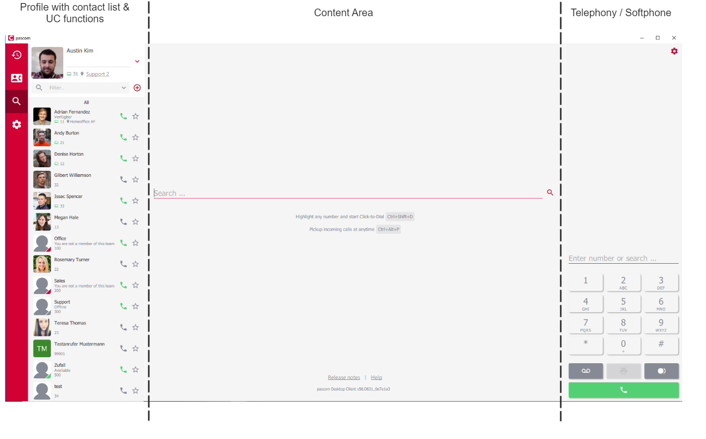
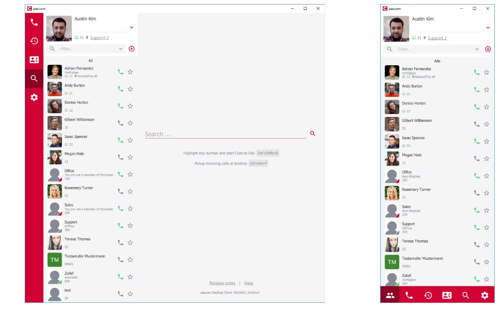
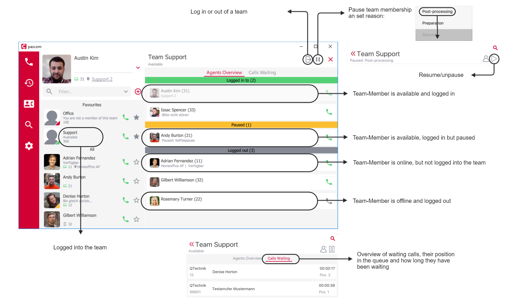
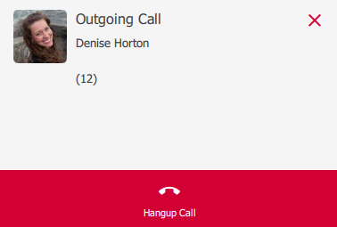
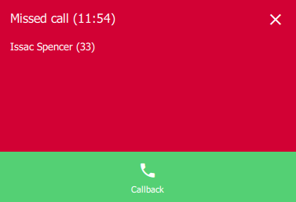
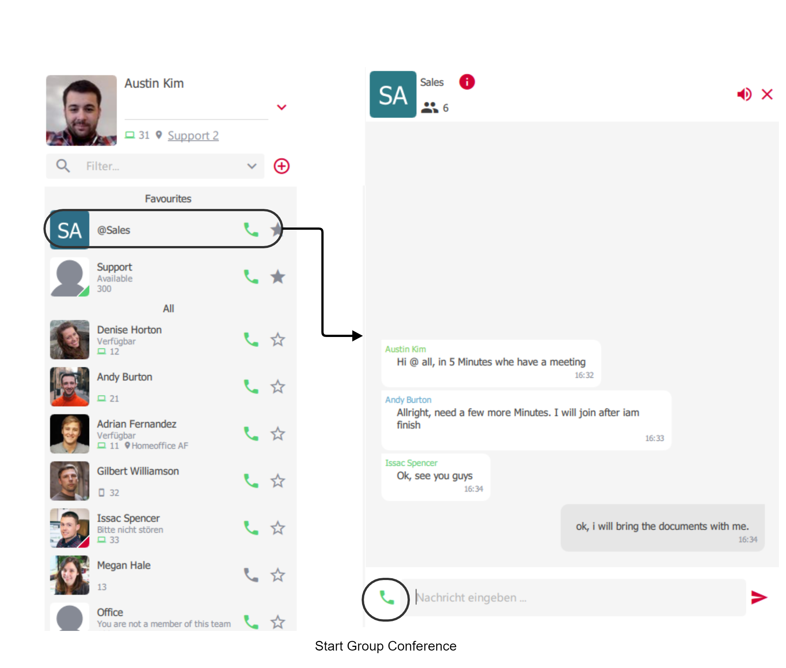
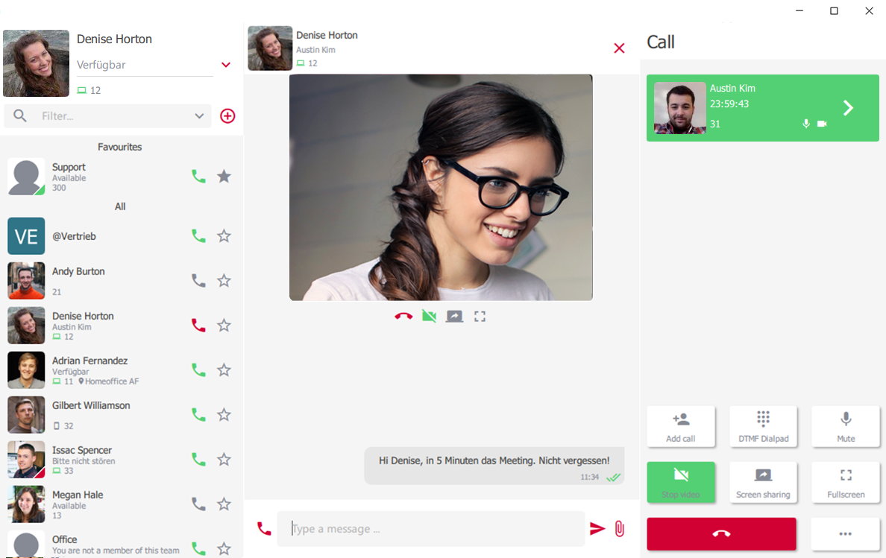
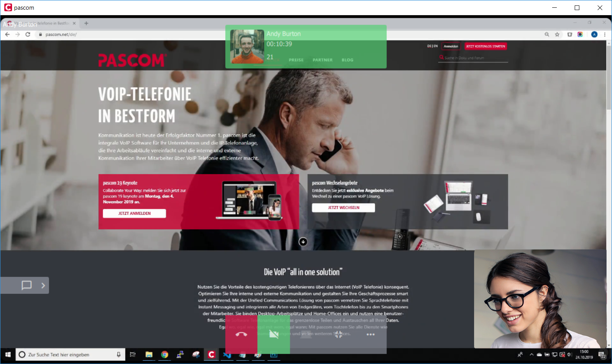
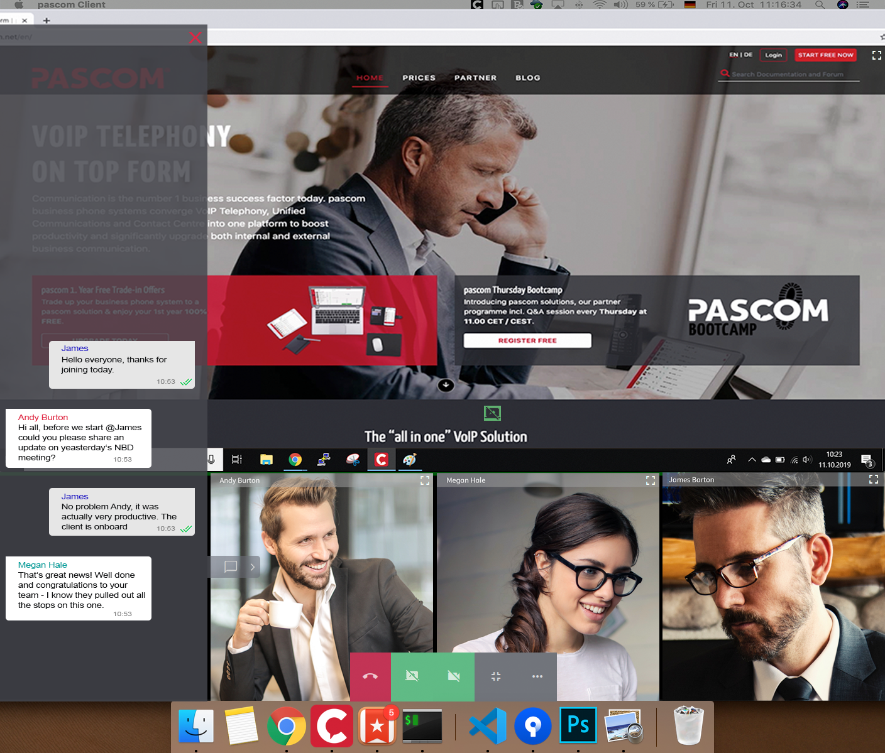


 


<!-- FIXME - bilder nur mit hellem theme! -->

<!--FIXME
- Amtsholung
- Hinweis auf unterstützte Headsets
- VErbinden -> Bilder mit einheitlichen Nummern
-->
## Training Video
 


## Login

That the added [user]() can login and use the pascom client den pascom Client, they will need their username and password.

|Field|Description|
|---|---|
|Username|username@instancename|
|Password|User password|
|Server|Domain or IP address of the server|
|Save login details?|Select the check box if your wish the allow the client to start automatically with the added login credentials.|

{}
Should you use a self-hosted "On-premise" phone system with only one instance, entering the @instancename component after the username is not necessary.
{}

## Overview

The Desktop client consists of three main components:

+ On the left hand side of the client, you will find your profile section, UC functions selector and contact list.
+ The right hand side is dedicated to telephony functions
+ The middle section is a flexible content area that changes depending on which UC tool is currently selected, i.e. Instant Messaging (Chat), Call History or Phone Books.

The desktop client also offers differing view modes:

+ **Expanded Mode**: Displays all three components, of which the middle section can be selected using the UC tool toggle list.
+ **Normal Mode**: The user profile and contacts are visible as well as it being possible to switch between the *Chats, Telephony, Call History,* and *Phone Book* tools.
+ **Mini Mode**: Only a single area is visible and the UC tool selector menu is now found under the content area. Using the selector tool, it is possible to navigate through all UC tools, changing the visible content area as you go.

In order to simplify switching the various views, it is possible to toggle the sizes using a [shortcut key]() if you choose to.

## Profile and Contacts List

|Function|Description|
|---|---|
|Presence Status|It is possible to update your presence status with the following options: - *Green* > Available - *Yellow* > Away - *Red* > Do Not Disturb / Busy (This option doesn't deliver DND functionality.) Status texts can be personalized according to requirements - simply select the correct presence and then click on the status text and replace it.|
|Create new group|With the "+ symbol" you can create a new permanent group.|
|Contact list filter|Filter contacts to display only certain contacts. Per default, two filters are available as standard - *Favorites* and *Teams*. Favorites can be add by clicking on the star symbol next to a contact's handset icon. Additional filters can be defined by the system administrator via Roles.|
|Contacts |[Contact Information]() list displaying contact presence, extension and contact information.|
|Phone Symbol |Click on the phone symbol to call the contact.|
|Favorite Symbol|Simply mark your favorite contacts with the "star" symbol. These are then pinned at the top of the contact list.|
|Teams | Under [Teams]() you will see all the teams of which you are either a permanent or dynamic member. The *Available* or *Offline* status signify whether you are currently logged into a team or not.|

## Contacts

Each contact in your contact list has various statuses, which can be seen in the following illustration.

## Teams

The teams function can be used to gain an overview of what's happening in the teams of which you are a member of. The teams tool also enables you to dynamically log in / out of a team (if your are a dynamic member) as well as being able to pause / resume your team membership plus seeing the status of other team members / queue agents and seeing any calls currently waiting in the queue.

## Integrated Softphone

If your user has been assigned a pascom softphone by your System Admin, then you can select your pascom softphone via the telephony settings menu.

In order to use the softphone, you will need to configure the following softphone settings; Microphone, Speaker (Audio output) and Ringing speaker. Even if your desktop client has automatically detected your headset, you will need to select it from the drop down list. Should your headset not automatically appear in the list, then please check your computers audio

## Making Calls
  
Before you starting phoning, please check your telephone settings. Particularly if you have multiple telephone assigned to your user account, it is essential to ensure that the correct device is selected.

### Start a Call

The desktop app offers numerous options for starting a call:

* Enter the number via the [Dialpad]().
* Call a colleague by clicking on the phone icon within the [Contact List]().
* Click on the phone icon in the [Call History]().
* Select a number from the [Phone Book]().

### Active Call

### Inbound Calls

### Transfer

#### Blind Transfer (Unattended Transfer)

A blind or unattended transfer is a transfer of a call from one party to another without talking to the new contact during the transfer. A blind transfer can be performed at anytime during a call by clicking on the 'Transfer' icon and dialing the new destination number (number to which the call should be transferred).

If you wish to transfer the call to an internal colleague, simply right click on the desired colleague's name / profile picture in the contact list and select *Transfer* from the menu.

#### Attended Transfer

To transfer a call having spoken to the party to whom the call should be transferred, please follow these steps:

1. Click *Add Participant*, to talk to the new party.
2. Now *Transfer* the caller with the newly added participant.

It is not necessary to place the caller on hold, as this is automatically done when the call to the new participant in step 1 is started either via the *Add Participant* button, the contact list, the phone book or via the call history logs. After completing step 2, the caller will be connected to the new party.

### 3-Way-Conferencing

A 3-way-conference is started in a similar fashon to an [Attended Transfer](/clients/client-user-guide/#attended-transfer) via a 2 step process.

1. Click the *Add Participant* button and call the required party.
2. To start a 3-way-conference simply click on the *Conference* button.

During a 3-way-conference call it is possible for the initiator to remove a party from the conference directly from the active calls list in the telephony section of the desktop app.

### Sending DTMF Tones

DTMF tones are used to enter information via the dialpad such as PIN authentication for conference rooms or when selecting the required choice in an options menu (press 1 for..., 2 for ..., 3 for ... etc) or even having to enter a number code to open an intercom door for example.

For the pascom Client to send DTMF tones, the pascom softphone is required and the DTMF tones can be sent during a call via the *Dialpad*.

## Search

The pascom desktop client includes an extensive search tool which can be accessed via the magnifying glass icon. When searching, the search tool will search all connected phone books, the call history and the chat archive. The search term can consist of multiple terms / words.

*Example*: when searching for the contact *"Max-Andreas Mustermann"* the search term *"And Muster"* is sufficient.

{}
The magnifying glass icon is visible within the content area no matter the client view (size).
{}

## Notifications

As soon as an event (call, message etc) occurs a popup notification will appear. These popup notifications provide additional information to the type of event i.e. caller name or chat contact name. The popups also allow users to react to the event without needing to refer to the desktop client.

|Notification|Description|
|---|---|
||Popup indicating an active outbound call with the ability to end the call by clicking on the red phone icon.|
||Popup notification indicating an active inbound call with the ability to pick up via the green phone icon.|
||Popup indicating an active call with the ability to: * hold the call via the pause symbol * to end the call by clicking on the red phone icon.|
||Popup notification indicating a missed call with the ability call back via the green phone icon.|
||Popup notification indicating a new chat message with the ability to respond direct from the popup.|

Via the settings menu, you can modify your notification settings:

## Groups

With the group function you create permanent groups which offer a lot of functions.

1. Group-Chat
2. Audio-Conferences
3. Video-Conferences
4. Online-Meetings with Screensharing

### Create Groups

In the contact list, click on the "+ - symbol" to create a new group. You can create as many groups as you like. In the next step you have to assign a group name, a group picture and add the desired participants. Finally, save the group with the "Floppy Disk Symbol". The new group will now appear in your contact list. 

### Manage Groups

To manage a group, click the appropriate group in the contact list. In the Content Area, a small information symbol appears in the upper section. Here you make changes to the group. If you no longer want notifications, you can mute the group using the speaker icon.

## Chat

There are 2 ways to start a chat conversation with a contact. With a direct click on the contact in the contact list or during a call in the call options.

### Group Chat

For a group chat a group is needed. If you have not yet created a group, first create a new [Group]().

Click on the desired group in the contact list. In the content area the conversation of the respective group appears. You can also start a group conference from there. To close the chat, just click on the X icon in the upper right corner.

### Chat Notifications

If the conversation area is not in focus and you receive a new message, a note appears in the contact list on the profile picture and also at the respective contact. On the profile picture you always recognize the whole, not yet read, messages. Contacts with new messages will automatically move up to the top of the contact list, if the sorting has been set to this behavior.

If your order is not set to automatically show the latest changes at the top of the contact list, you can click on the number of unread messages on your profile picture. The smart filters will then only show the contacts that contain new messages.

## File Transfers

The desktop client allows you to share files with your colleagues which can done via either one of the following three methods:

1. In an ongoing, active chat simply click on the paper clip symbol (bottom right of the chat area). This will allow you to select a file from your computer which can then be sent:

2. In an active chat with a colleague, you can add the file to be transferred by drag and drop. Upon dropping the file will be sent:

3. Should you not have an active chat open, it is possible to send a file to a colleague by dragging the file to the desired contact's profile listing in the contact list. Drop the file on the contact and the file will be sent:

## Group Conferences

It often happens that you have to quickly coordinate with contacts. In order not to occupy a conference room every time, there are the groups conferences.
For a group conference a group is needed. If you have not yet created a group, first create a new [Group]().

### Start/Join Group Conferences

To start or join a group conference, simply call the appropriate group. The system will tell you all the necessary information about the conference, just like in a conference room.

If there are already colleagues in a group conference, this is indicated by the fact that the group is now highlighted in green. You can easily join by calling the group.

### Active Group Conferences

During the group conference a number of functions are available to you.

1. Group Chat
2. Switch to Video Session
3. Start Screensharing

You can leave the Group Conference over the red phone Symbol.

## Video and Screensharing

### Video-Call

During a call, you can easily switch to video telephony if there is a webcam available. Whether your webcam works properly, you can see it in the client settings.

The video call starts by default in full screen mode.

The chat icon opens the current chat conversation of the contact or group. The video menu offers the following options:

|Option|Description|
|---|---|
|Hang Up| Stops the complete call.|
|Video on/off|start/stop the video call and returns to the normal audio call.|
|Screensharing on/off|start/stop Screensharing.|
|Fullscreen off|Minimizes the fullscreen and integrates video / screen sharing into the content area of ​​the client.|
|More Options (3 Dots)|Expant the menue.|
|DTMF Dialpad|Shows the dialpad.|
|Mute on/off|Turns the microphone off / on.|
|Change Camera|Change the Camera from Font to Back - Works only on Mobile Devices.|

When you exit full-screen mode, the active video / screen sharing call is minimized and integrated into the client. From there you have access to the usual functions again. Of course, you can also switch back to full-screen mode with the buttons below the video window.

### Screensharing

During the call, you can share your screen content with your conversation partner by clicking on the screen sharing button.

By default, the screen sharing session starts in fullscreen mode. You have the same [Options]() as you have with a video call. 

### Video-Call and Screensharing at the same time

During a [Video-Call]() you can simultaneously share your screen content with the party member. Simply click on Start Screen Sharing in the menue. 

The video area will then be automaticly minimized and makes room for the screen content of the caller. Again, all the usual [options]() are available again.

## Audio/Video groups with Screensharing

The base for the following functions is a group. If you do not have a group yet, you need to create a new [group]() first.  

Start a new [group conference]() or join an existing group conference. Now you can use the [video]()- and [screensharing]() feature with multiple conference participants.

## Call History

The Call History provides an overview of all your calls.

By using the right click function, it is possible to use do the following when clicking on a call in the log:

* Copy all details pertaining to a caller (Time, type of call, caller name (if available), and their phone number),
* Copy only the phone number to store or edit elsewhere,
* Send the number to the dialpad

## Telephone Book

The client provides access to the company phone book as well as your private phone book which you can manage yourself. Add a contact to the private phone book and this display name will displayed by incoming calls but only in your desktop client.

## Fax

If a fax number is already stored in the phone book, it is possible to send a fax by clicking on the fax symbol in the phone book:

## Call Voicemail

By clicking on the Voicemail box symbol, it is possible to call your voicemail box directly. Additional options can be configured by following the prompts in the voicemail system itself.

## Shortcut Keys

{}
Shortcut keys are only available in the desktop client for Windows and macOS.
{}

When installing the client, the shortcut keys are predefined. However, if needed the shortcut keys can be freely customised according to your preference.

### Global Shortcut Keys:

|Shortcut Key|Description|
|---|---|
|Smart On / Off Hooking |Enables incoming call pickup via shortcut key, even when the client is not the active window.|
|Click-to-Dial|Enables dialing a number direct from a browser or document by highlight and pressing the shortcut keys.|
|Toggle Window|This function enables either bringing the client to the foreground or to minimise the client via a shortcut key.|

## Client Settings

|Settings|Description|
|---|---|
|Language|Current languages available include: English, German, French, Dutch, Serbian and Bavarian.|
|Colour Scheme|Available in a two colour schemes: light and dark.|
|Download Folder|Per default, your downloads folder will be used, however it is possible to customize according to your requirements.|

## pascom Client Feedback  

Should you discover an issue / problem with your client, you can view detailed info via the Open Client Logs button in the Settings menu. Should you wish to report a bug, please send the  *Support-Info* ZIP file to us.

