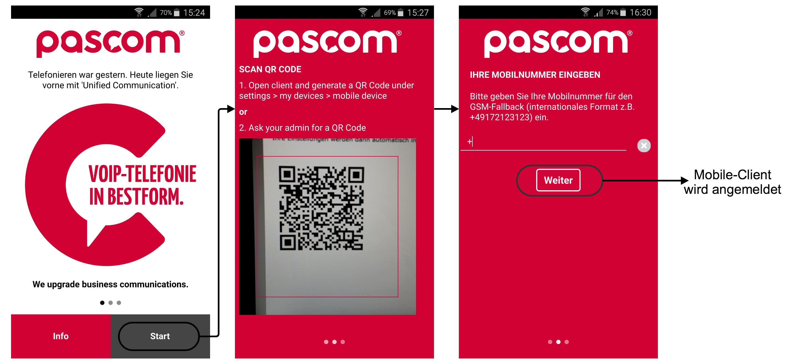
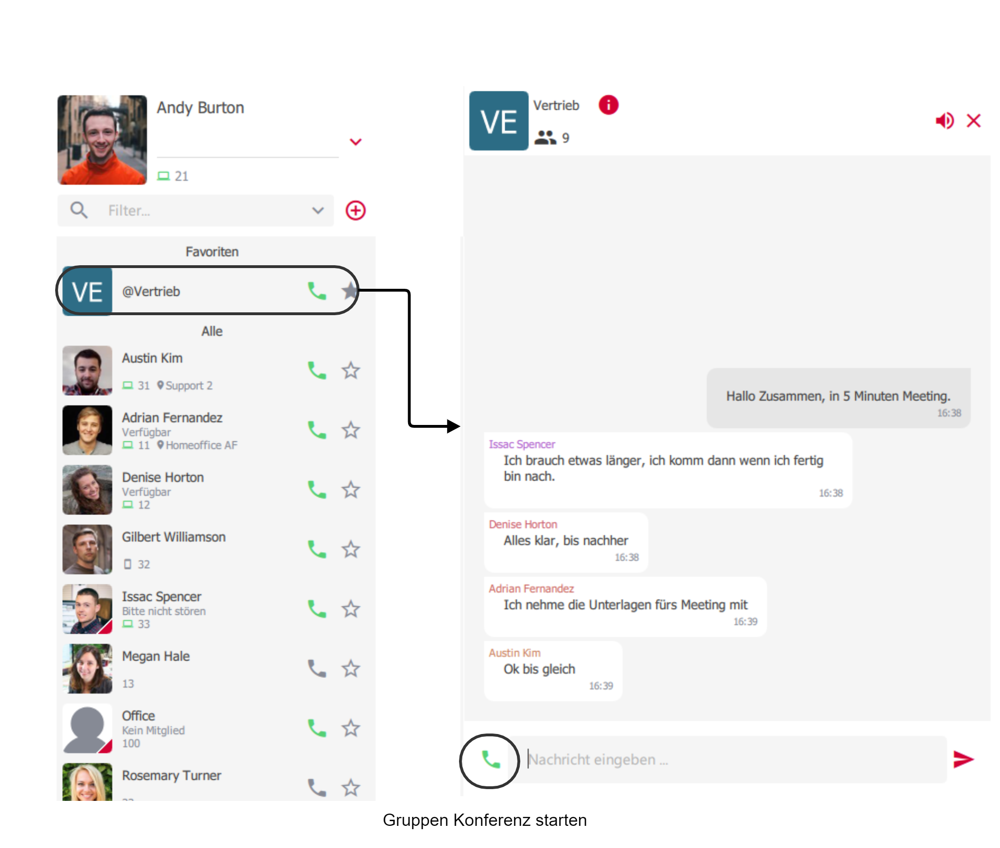
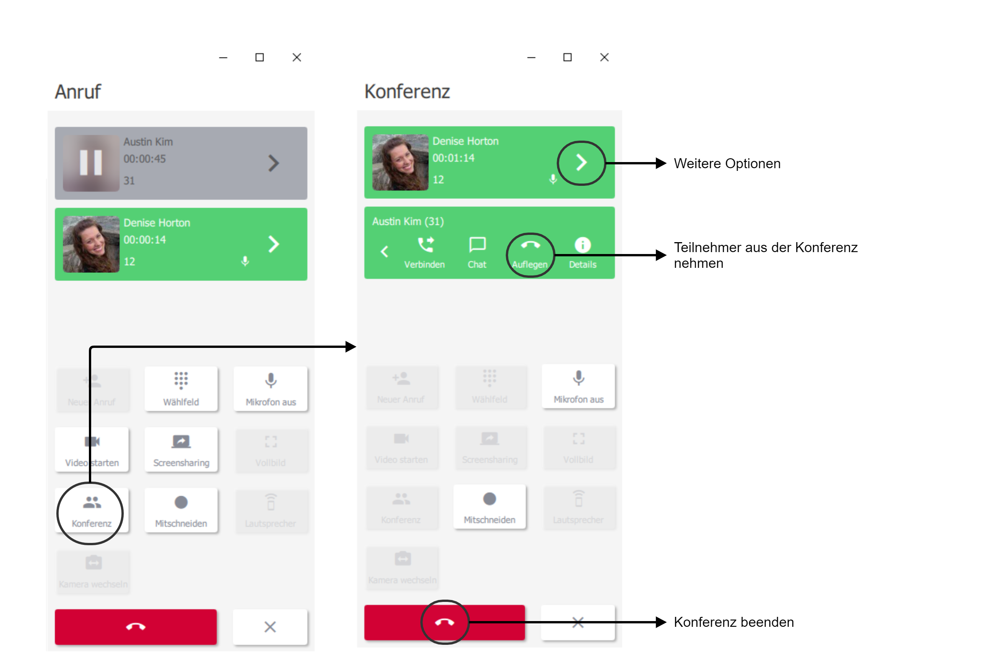
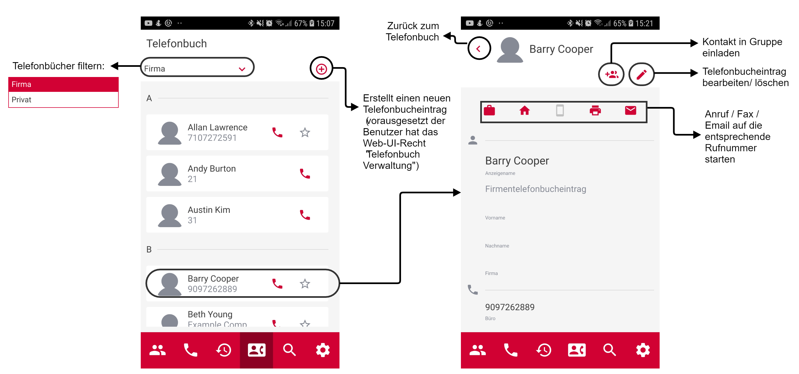
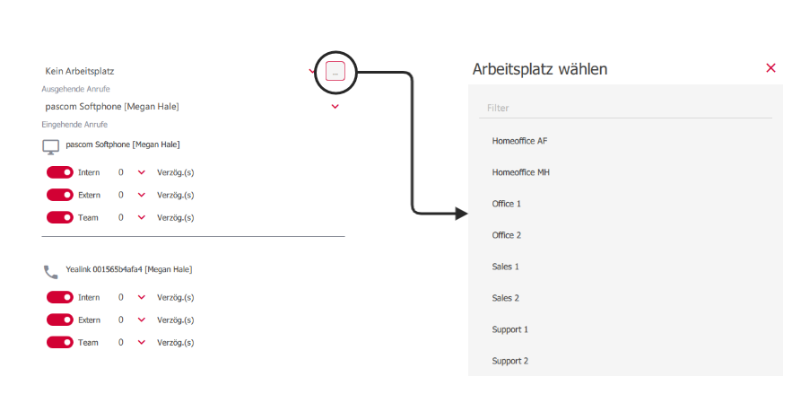


 


<!--- Bilder nur mit hellem Theme! --->

## Benutzer anmelden

{}
Um sich am pascom Mobile Client anmelden zu können ist zuvor einmalig der Pairing-Vorgang notwendig.
Dieser kann vom [Administrator]() durchgeführt werden oder, mit den notwendigen Berechtigungen, auch vom Endandwender selbst.
{}

### Pairing-Vorgang

* Starten Sie den [pascom Desktop Client]() und wählen Sie unter  >  bei Ihrem zugeordneten Mobiltelefon die Schaltfläche **Pair** um den Pairing-Vorgang anzustoßen.

* Geben Sie Ihr Benutzerpasswort für den pascom Desktop Client ein und klicken Sie auf **Weiter**. Jetzt werden Ihnen weitere Anweisungen und ein QR-Code angezeigt. Jeder QR-Code ist 5 Minuten gültig und erneuert sich nach Ablauf der Zeit automatisch oder kann mit einem Klick auf **Erneut generieren** manuell neu generiert werden.

{}
Folgende Anweisungen werden Ihnen direkt im pascom Desktop Client angezeigt.
{}

3. Laden Sie sich den pascom Mobile Client aus dem [AppStore](https://www.pascom.net/appstore) für iOS-Geräte bzw. [PlayStore](https://www.pascom.net/playstore) für Android-Geräte auf Ihr Mobiltelefon herunter.

4. Sobald die Installation abgeschlossen ist starten Sie den pascom Mobile Client auf Ihrem Mobiltelefon und klicken Sie auf **Start**.

5. Scannen Sie nun mit Ihrem Mobiltelefon den QR-Code, der Ihnen im pascom Desktop Client angezeigt wird.

6. Geben Sie im nächsten Schritt Ihre Mobilrufnummer im internationalen Rufnummernformat ein, oder lassen Sie das Feld leer, wenn Sie die Telefonie über GSM nicht nutzen möchten, und klicken Sie auf **Weiter**.

7. Nach Abschluss des Pairing-Vorgangs werden Sie automatisch am pascom Mobile Client angemeldet.

{}
Sobald der pascom Mobile Client angemeldet wurde, kann dieser unabhängig vom [pascom Desktop Client]() genutzt werden. Ein Simultanbetrieb ist **NICHT** notwendig.
{}

## Übersicht

Der pascom Mobile Client besteht grundsätzlich aus 6 Bereichen:

+ Die [**Kontaktliste**]() enthält alle Kontakte, Favoriten und Teams
+ Im [**Telefonie**]()-Bereich können Gespräche und Konferenzen geführt werden. Auch die eigene Voicemailbox ist hier zu finden
+ Im [**Journal**]() ist eine Übersicht aller getätigten Anrufe zu finden
+ Das [**Telefonbuch**]() enthält die Einträge aus dem privaten und Firmen-Telefonbuch
+ In der [**Suche**]()findet man schnell Suchergebnisse zu allen möglichen Bereiche.
+ Alle **Einstellungen** zum Benutzerprofil, pascom Mobile Client und den eigenen Geräten befinden sich hier

## Profil und Kontaktliste

Funktionen in der Kontaktliste:

|Funktion|Beschreibung|
|---|---|
|Verfügbarkeits-Status|Es stehen zur Auswahl: - *grün* > Verfügbar - *gelb* > Bin gleich zurück - *rot* > Bitte nicht stören (Diese Einstellung hat keine DND-Funktionalität.) Die Status-Texte können Sie nach Bedarf ändern.|
|Neue Gruppe erstellen|Über das "+ Symbol" können Sie eine neue permanente Gruppe erstellen.|
|Filter für Kontaktliste|Über die Filter/Suche finden Sie schnell, anhand Ihrer Eingaben, die gewünschten Kontakte in Ihrer Kontaktliste.|
|Kontakte|Hier erhalten Sie Informationen über Ihre [Kontakte]().|
|Hörer-Symbol|Mit einem Klick auf den Hörer rufen Sie den Kontakt an.|
|Favoriten makieren|Mit dem "Sternchen-Symbol" makieren Sie ganz einfach Ihre favorisierten Kontakte. Diese werden dann oben in der Kontaktliste angepinnt.|
|Teams|Hier sehen Sie die [Teams]() in denen Sie ein festes oder flexibles Mitglied sind. Der Status *Verfügbar* oder *Offline* bezieht sich in diesem Fall darauf, ob Sie eingebucht sind oder nicht.|

## Kontakte

Jeder Kontakt in Ihrer Kontaktliste besitzt diverse Status, welche anhand der folgenden Darstellung erkennbar sind.

### Teams

Funktionen in der Teamübersicht:

|Funktion|Beschreibung|
|---|---|
|Mitglieder|Hier werden Ihnen alle angemeldeten (**grün**), pausierten (**gelb**) und inaktiven Mitgleider (**grau**) des ausgewählten Teams angezeigt.|
|Im Team ein-/ausbuchen oder pausieren|Sie können sich hier über die entsprechenden Schaltflachen im Team einbuchen (+), ausbuchen (-), pausieren (II) oder die Pause beenden|
|Wartende Anrufer|Hier werden Ihnen alle Anrufer, die derzeit in der Warteschlange des ausgewählten Teams warten angezeigt.|

## Gruppen

Mit der Gruppen-Funktion erstellen Sie permanente Gruppen welche eine menge Funktionen bieten.

1. Gruppen-Chat
2. Audio-Konferenz
3. Video-Konferenz

### Gruppe erstellen

Klicken Sie in der Kontaktliste auf das "+ - Symbol" um eine neue Gruppe zu erstellen. Sie können so viele Gruppen anlegen, wie Sie möchten. Im nächsten Schritt vergeben Sie einen Gruppennamen, Gruppenbild und fügen die gewünschten Teilnehmer hinzu. Abschließend speichern Sie die Gruppe mit dem "Disketten-Symbol". Die neue Gruppe erscheint nun in Ihrer Kontaktliste.

### Gruppe verwalten

Um eine Gruppe zu verwalten, klicken Sie in der Kontaktliste auf die entsprechende Gruppe. Im Contentbereich erscheint im oberen Abschnitt ein kleines Infosymbol. Hier nehmen Sie Änderungen an der Gruppe vor. Wünschen Sie keine Benachrichtigungen mehr, können Sie die Gruppe über das Lautsprechersymbol stummschalten.

## Chat

Es gibt 2 Möglichkeiten eine Chat Konversation mit einem Kontakt zu starten. Mit einem direkten Klick auf den Kontakt in der Kontaktliste oder während einem Gespräch in den Anrufoptionen.

### Gruppenchat

Für einen Gruppenchat wird eine Gruppe benötigt. Haben Sie noch keine Gruppe angelegt, erstellen Sie sich zunächst eine neue [Gruppe]().

Klicken Sie in der Kontaktliste auf die gewünschte Gruppe. Im Contentbereich erscheint nun die Konversation der jeweiligen Gruppe. Sie können von dort aus auch eine Gruppen-Konferenz starten. Zum Verlassen des Chats, klicken Sie einfach auf das X Symbol in der oberen rechten Ecke.

### Chatbenachrichtigungen

Ist der Konversations-Bereich nicht im Fokus, und Sie erhalten eine neue Nachricht, so erscheint in der Kontaktliste am Profilbild und am jeweiligen Kontakt eine Hinweismeldung. Am Profilbild erkennen Sie immer die gesamten, noch nicht gelesenen, Nachrichten. Kontakte mit neuen Nachrichten, rutschen in der Kontaktliste automatisch nach oben, sofern die Sortierung so eingestellt wurde.

 Sollte Ihre Sortierung nicht so eingestellt sein, dass die letzten Änderungen automatisch oben in der Kontaktliste erscheinen, können Sie mit einem Klick auf die Nummer, der noch nicht gelesenen Nachrichten an Ihrem Profilbild, klicken. Mit Hilfe der Smart Filter werden dann nur die Kontakte angezeigt, die neue Nachrichten enthalten. 

Zusätzlich erhalten Sie, bei eingehenden Nachrichten, eine Pushup Benachrichtigung.

Außerdem zeigt Ihnen das pascom Symbol auf der Startseite ebenfalls die Anzahl ungelesener Nachrichten an. 

<!--- TODO: Noch nicht in der App umgesetzt
### Dateien versenden
--->

## Telefonieren

### Gespräch starten

Der Client bietet mehrere Möglichkeiten ein Gespräch zu starten:

* Geben Sie im [Wählfeld]() eine Nummer ein.
* Rufen Sie einen Kollegen an, indem Sie auf das grüne Hörer-Symbol in der [Kontaktliste]() klicken.
* Klicken Sie das Hörer-Symbol im [Journal-Eintrag]() an.
* Wählen Sie eine Nummer im [Telefonbuch]().

### Aktives Gespräch

### Eingehender Anruf

### Verbinden

#### Blind Transfer (Verbinden ohne Rücksprache)

Während eines Gesprächs können Sie einen Gesprächspartner ohne Rücksprache weiter verbinden.  Klicken Sie auf 'Verbinden' und wählen Sie die neue Zielrufnummer.

Möchten Sie den Anrufer an einen Kollegen verbinden, rechts-klicken Sie auf dessen Namen oder Profilbild in der Kontaktiliste und wählen Sie *Transfer*.

#### Attended Transfer (Verbinden mit Rücksprache)

Das Verbinden mit Rücksprache erfolgt in zwei Schritten:

1. Einen weiteren *Anruf hinzufügen*, um Rücksprache zu halten.
2. Den ersten Anrufer mit dem hinzugefügten Anrufer *verbinden*.

Es ist nicht notwendig den ersten Anruf extra zu halten. Dieser wird automatisch gehalten, wenn, wie in Schritt 1 beschrieben, der neue Anruf gestartet wird. Anschließend wird im Schritt 2 der Anrufer verbunden.

### Dreierkonferenz

Die Dreierkonferenz wird ähnlich wie [Attended Transfer]() in zwei Schritten eingeleitet. Im ersten Schritt wird, wie bereits bekannt, der Anruf hinzugefügt.

Im Schritt 2 werden beide aktiven Anrufe mit dem Klicke auf *Konferenz* zu einer Dreierkonferenz zusammengeschalten. Im Schritt 3 können Sie, als Initiator der Dreierkonferenz, einen Teilnehmer aus der Konferenz entfernen.

### DTMF-Töne senden

DTMF-Töne werden verwendet um z. B. in einem Konferenzraum eine PIN zur Authentifizierung einzugeben, wenn Sie in einer Hotline durch die Eingabe von 1, 2 oder 3 an den/die gewünschten Gesprächspartner gelangen möchten oder mit einem Nummerncode eine Tür öffnen müssen.

Um mit dem pascom Client unter Verwendung des pascom Softphones DTMF-Töne zu versenden klicken Sie während des laufenden Gesprächs auf das *Wählfeld*.

## Suche und Smart Filter

### Suche

Der Client bietet über das Lupen-Symbol eine sehr umfangreiche Suche. Geben Sie einen Suchbegriff ein, werden Telefonbücher, Journal-Einträge, Kontakte und das Chat-Archiv durchsucht. Der Suchbegriff kann dabei aus mehreren Begriffen und sogar aus mehreren Wortteilen bestehen.

*Beispiel*: Sie suchen nach dem  Kontakt *"Max-Andreas Mustermann"* reicht der Suchbegriff *"And Muster"*.  

Die Suchfunktion kann auch im Wählfeld genutzt werden, um schnell Kontakte z.B. für Konferenzen oder Transfers zu finden.

### Smart Filter

Smart-Filter sind ein tolles Werkzeug um seine Kontaktliste schnell nach bestimmten Attributen oder Status zu filtern z.B wer ist gerade Online oder zeige nur meine Favoriten.

### Benachrichtigungen

Auch wenn der pascom Mobile Client nur im Hintergrund auf Ihrem Mobiltelefon läuft oder Sie den Telefonie-Bereich nicht im Fokus haben, wird Ihnen der aktive Anruf als Statusmeldung auf Ihrem Mobiltelefon angezeigt, über die Sie jederzeit zum aktiven Gespräch im Telefonie-Bereich des pascom Mobile Client wechseln können.

### Voicemailbox abrufen

Mit dem Klick auf das Voicemailbox-Symbol können Sie Ihre Voicemailbox direkt anrufen. Weitere Optionen erfolgen über die Ansagen der Voicemailbox.

## Journal

Das Journal gibt eine Übersicht über alle getätigten Anrufe.

Klicken Sie auf einen Journal-Eintrag um detaillierte Informationen zu diesem Anruf anzeigen zu lassen. Hier haben Sie auch die Möglichkeit einen Rückruf anzustoßen.
Im Journal haben Sie außerdem die Möglichkeit durch gedrückt halten des Eintrags Details des Anrufers zu kopieren (Name des Anrufers, falls vorhanden und die Telefonnummer).

## Telefonbuch

Der Client bietet neben dem Firmen-Telefonbuch auch ein eigenes (privates) welches Sie selber anlegen und pflegen können. Legen Sie einen Eintrag in Ihrem privaten Telefonbuch, wird dessen Name bei einem eingehendenen Anruf nur in Ihrem Client angezeigt.  

Möchten Sie externe Kontakte aus Ihrem Telefonbuch in die Kontaktliste mit aufnehmen, so können Sie im Telefonbuch den entsprechenden Kontakt als Favorit markieren.
## Client-Einstellungen

### Profil Einstellungen

|Einstellung|Beschreibung|
|---|---|
|Avatar|Ändern Sie Ihr Profilbild. Lassen Sie sich ein Profilbild generieren oder laden Sie sich ein Profilbild vom Computer hoch.|
|Kontaktliste|Sortieren Sie Ihre Kontaktliste nach Ihren Anwendungsvorlieben.|
|Listenstil|Es stehen 2 Kontaktlistenstile zur Verfügung. "Listenansicht" für eine schmale Kontaktliste und "Details" für eine detailiertere Ansicht.|
|Automatische Abwesenheit|Ist Ihr Computer nicht gespehrt und Ihre Maus bewegt sich für XXX Sekunden nicht, wechselt Ihr Status auf gelb "Bin gleich zurück"|
|Journal / Systemanrufe ausblenden|Blendet Systemanrufe wie Voicemail etc. aus dem Journal aus.|
|Passwort ändern|Passwort neu vergeben - funktioniert nur, wenn das Passwort nicht von extern kommt (z.B. Active Directory)|

### Meine Geräte / Follow Me Einstellungen

In den Follow Me Einstellungen bestimmen Sie selbst, sofern es durch den Administrator freigeschalten wurde, welche Ihrer Endgeräte wann klingeln soll. Zusätzlich können Sie vordefinierte Arbeitsplätze auswählen, an denen Sie sich anmelden können.

1. Bestimmen Sie Ihr Endgerät das für ausgehende Telefonate verwendet werden soll.
2. Legen Sie fest, welches Ihrer Endgeräte wann klingeln soll. 
3. Pairen/unpairen Sie Ihr Mobilgerät. 

