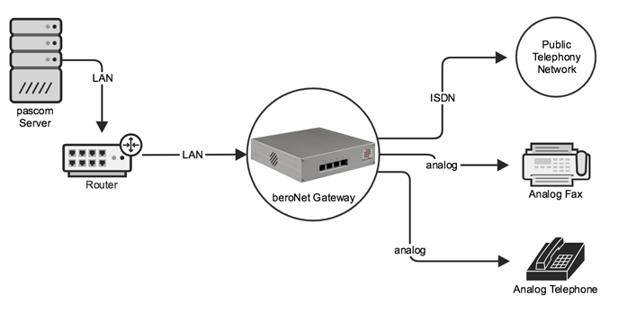
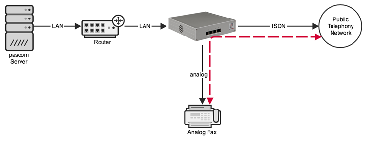





### Overview

beroNet Gateways are connected via LAN and assigned an IP address from the telephone network. Connections to the public telephone network and analogue terminal devices are established using the front ports. beroNet Boxes allow for the installation of various modules. Depending on the module, the front ports are compatible with analogue or ISDN devices. Due to the LAN connection, beroNet Boxes can be easily integrated with a pascom virtual appliance.

### Direct Trunk Connection of Endpoints (Optional)

{}  
This function only makes sense in combination with an ISDN trunk located on the same Gateway.
{}

If you wish to use your beroNet Gateway to operate ISDN or Analog endpoints in combination with an ISDN trunk on the same box, then use the option to directly connect the endpoints directly to the trunk without needing to route calls over the complete path to the phone system. 

Calls will not be converted to SIP and sent over the phone system server, but rather they are routed directly on the beroNet device. If, for example, there is an inbound call for the fax device, the beroNet device will directly connect it to the fax device.

The advantage of this approach is that connections are not converted to SIP, which gives superior results when **fax applications** are used. Direct connections can also be used if **ISDN data** must be transmitted.

The disadvantage here is that the PBX will not be made aware of these calls. Therefore, the server is not able to manage the call flow, e.g. forward the call to another device after a timeout, check for business hours, etc. In addition to that, the ISDN trunk and the extension must be connected to the same beroNet hardware.

Whether an endpoint should be routed directly on a trunk or via the pascom phone system can be configured when adding the ISDN or Analog endpoint. 

### Configuration

## Gateway Preparation

The first step of preparation is to mount suitable modules on the beroNet Gateway. If you ordered your hardware via pascom, the modules will already be pre-installed. For further details such as port assignment etc, please refer to the [beroNet Documentation](https://beronet.atlassian.net/wiki/spaces/PUB/pages/51085410/Gateways+and+Cards "beroNet Documentation").

Connect the Gateway to you LAN network, connect the power supply cable and then wait until the Gateway is fully booted (The LEDs on the ISDN / Analog connected mounted modules will be illuminated or blinking - this process can take a few minutes).

The Gateway IP address will be automatically assigned via DHCP. In case you do not have a DHCP server in your network, the Gateway will automatically revert to the standard IP address **10.0.0.2**

### Detect Gateway in the Network (optional)

Should you not be able to determine the Gateway's IP address, you can find the Gateway in your network using the beroNet Tool **bfdetect** and if necessary change the IP address. **bfdetect** only works when the PC running the tool and the Gateway are both located in the same network segment. 

* [BFDetect Tool for Windows (x86)](bfdetect_win_x86.zip)
* [BFDetect Tool for Windows (x64)](bfdetect_win_x64.zip)
* [BFDetect Tool for Linux](bfdetect_src.tar.gz)

### Firmware Update (optional)

{}
pascom phone system server's from version 18 onwards required a minimum of the **beroNet Firmware 16** or higher.
{}

Log into the beroNet Gateway web UI (per default User: admin, password: admin) and under **Management** > **Info** that you use appfs **16 or newer**. If not, update the box now:

* Download the [Firmware 16.X](https://beronet.atlassian.net/wiki/spaces/PUB/pages/61210659/Tools+and+Downloads) (Section: beroNet OS)
* Under the beroNet **Management** > **Firmware update** select the update mode. 
* Upload the firmware 16.X after the reboot and start the update

### Setup VPN Gateway (Cloud Only)

The pascom instance hosted in pascom.cloud must be able to reach the beroNet Gateway via IP address. This is only possible by using a VPN between the beroNet Gateway location and your pascom cloud hosted PBX. To simplify this process, pascom phone systems include the option of adding a [VPN Connector]().

### Adding the beroNet Gateway

Log into the pascom cloud phone system instance's admin web UI and navigate to the add Gateways menu:  >  >  > .

{}
Wait for the search process to finish, which will only find beroNet PCIe cars, not Gateways!
{}

After the search process, select  and enter your Gateway's IP address, netmask and login credentials.

Click  and apply your jobs in the job box.

### Copy the Provisioning URL

Select the Gateway in from the list and click  and copy the URL to the clipboard.

Log into the beroNet box web UI and ensure that you have selected **Advanced** under the **GUI mode**.

Under **Preferences** > **Provisioning**, enter the following values:

|Field|Value|
|---|---|
|Manual Config| activate|
|Provisioning on Boot:|**always**|
|Provisioning-URL|Paste the previously copied URL|
|Polling Interval (min.)|Leave blank|

Save your changes and the beroNet box will now restart. 

### Creating ISDN trunks

A common use case for beroNet hardware is to connect ISDN trunks to it. To do so, select the gateway you want to use from the list, click the  button and then switch to the **Allocation** tab.

Click  to configure either a **BRI** or **PRI Trunk line** .

Double-clicking on the field **Name**. This will open a more detailed view in which you can select which **Ports** are allocated to the trunk. It is possible to select multiple options here, for example, for a BRI connection multiple NTs are aggregated so they form a single trunk.

Under **Mode** and **Technology** configure the interface type. For BRI connections, the interface should be set to **TE** and **PTP**.

You have now configured the interface of the beroNet hardware. For complete functionality, you should now continue with the appropriate Trunks and Call Rules configuration under  >  > . To help you, use the **Trunk Template** **beroNet Gateway**. 

### Add ISDN or Analog Terminals

Select the desired Gateway from the list and press  and switch to the **Allocation** tab.

The **Add** dropdown includes the following options:

|Type            |Description   |Uses |
|---------------|---------------|---------------|
|Analogue terminal directly | Analogue terminal device being routed directly on beroNet hardware| Fax, door control, fire alarm system|
|Analogue terminal via SIP| Analogue terminal device being routed on the PBX| Telephones|
|ISDN telephone directly| ISDN telephone being routed directly on beroNet hardware| Emergency phone|
|ISDN fax directly| ISDN fax being routed directly on beroNet hardware| Fax server (e.g. Tobit Faxware)|
|ISDN data directly| ISDN data transmission line being routed directly on beroNet hardware| Online banking, ISDN machine control, Security alarm|
|ISDN telephone via SIP| ISDN telephone being routed on the PBX| Telephones|

You have now configured the connection of the beroNet hardware. For complete functionality, you should now continue with Endpoint deployment under  >  >  and select the appropriate endpoint type listed under  from the list.