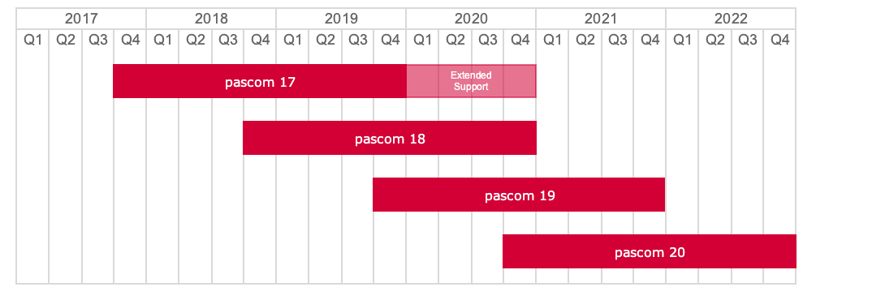



## Supported Server Versions

### What does supported version mean?

This is the most recent bugfix release of a pascom server version. For supported versions only pascom guarantees:

- Updates, bug fixes and security fixes
- pascom PREMIUM Support
- Compatibility of the pascom desktop and mobile clients
- Compatibility of the server license

### Can I still use unsupported versions?

pascom does **not block** the use of unsupported versions **in any form**, but you have to expect the following consequences:

**1) Updates, bug fixes and security fixes**

Unsupported versions will not receive updates, bug fixes or security fixes. Since the pascom server in many cases must be connected to the Internet because of the pascom clients, the operation of an unsupported server version is negligent.

**2) pascom PREMIUM Support**

Our fee-based PREMIUM support will not give you any help when using unsupported versions and you first have to update to a supported version.

**3) Compatibility of pascom desktop and mobile clients**

The pascom desktop and mobile clients are updated centrally. Since pascom tests the compatibility of the clients only for supported versions, it may be that the clients can no longer connect to the server after an update or some functions are defective. You can disable the auto-update for the desktop client with the **-noUpdate** command-line parameter, but this does not apply to mobile clients distributed by third-party vendors such as Apple or Google.

In addition, each user is permanently shown a message that the client is connected to a non-supported server.

**4) Compatibility of the server license**

For all **pascom 17 servers and older** the licenses are not updated automatically. Here it may be that pascom can not make changes to the license for unsupported server versions. For example, an adjustment of the number of users (= additional purchase) without updating the server version is no longer possible.

All **pascom 18 servers and newer** automatically update the license according to the paired subscription on a daily basis. In exceptional cases, an unsupported server version may become incompatible with this license. As a result, after 30 days the server can only accept incoming calls, or license values (for example, number of user counts) are no longer correctly accepted. We try to avoid this but guarantee compatibility only for supported server versions.

### Will I be warned before my version's support expires?

About three months before the server version you are using is no longer supported, all pascom clients display a brief message after logging in.

### What is "Extended Support"?

Due to the change in technology from pascom 17 to 18 and the associated additional expenses for our customers and partners, pascom extends the support for this version by one year and continues to guarantee:

- pascom PREMIUM Support
- Compatibility of the pascom desktop and mobile clients

## Release Notes

### pascom Client

|Version|Release Type|Published|
|-------|------------|---------------:|
|[Release 51.R365]()| Bugfix Release | 27.05.2019 |
|[Release 50.R318]()| Bugfix Release | 24.04.2019 |
|[Release 49.R265]()| Bugfix Release | 21.03.2019 |
|[Release 48.R196]()| Bugfix Release | 08.03.2019 |
|[Release 47.R161]()| Bugfix Release - Desktop only | 11.02.2019 |
|[Release 46.R152]()| Bugfix Release | 06.02.2019 |
|[Release 45.R93]()| Bugfix Release | 17.12.2018 |
|[Release 44.R66]()| Bugfix Release | 27.11.2018 |
|[Release 42.R34]()| Feature Release | 17.10.2018 |

### pascom Server 18

|Version|Release Type|Published|
|-------|------------|---------------:|
|[Release 18.07]()| Bugfix Release | 10.04.2019 |
|[Release 18.06]()| Bugfix Release | 07.03.2019 |
|[Release 18.05]()| Bugfix Release | 26.02.2019 |
|[Release 18.04]()| Bugfix Release | 16.01.2019 |
|[Release 18.03]()| Bugfix Release | 17.12.2018 |
|[Release 18.02]()| Bugfix Release | 07.11.2018 |
|[Release 18.01]()| Bugfix Release | 09.10.2018 |
|[Release 18.00]()| Feature Release | 20.09.2018 |

## pascom Server 17

|Version|Release Type|Published|
|-------|------------|---------------:|
|[Release 17.12]()| Bugfix Release | 22.11.2018 |
|[Release 17.11]()| Bugfix Release | 25.09.2018 |
|[Release 17.10]()| Bugfix Release | 19.06.2018 |
|[Release 17.09]()| Bugfix Release | 24.05.2018 |
|[Release 17.08]()| Bugfix Release | 23.04.2018 |
|[Release 17.07]()| Bugfix Release | 05.04.2018 |
|[Release 17.06]()| Bugfix Release | 03.04.2018 |
|[Release 17.05]()| Bugfix Release | 12.03.2018 |
|[Release 17.04]()| Bugfix Release | 26.02.2018 |
|[Release 17.03]()| Bugfix Release | 12.02.2018 |
|[Release 17.02]()| Bugfix Release | 22.01.2018 |
|[Release 17.01]()| Bugfix Release | 08.01.2018 |
|[Release 17.00]()| Feature Release | 14.12.2017 |

## pascom TAPI client

|Version|Release Type|Published|
|-------|------------|---------------:|
|[Release 4.R56]()| Bugfix Release | 08.03.2019 |
|[Release 3.R42]()| Feature Release | 09.10.2018 |
