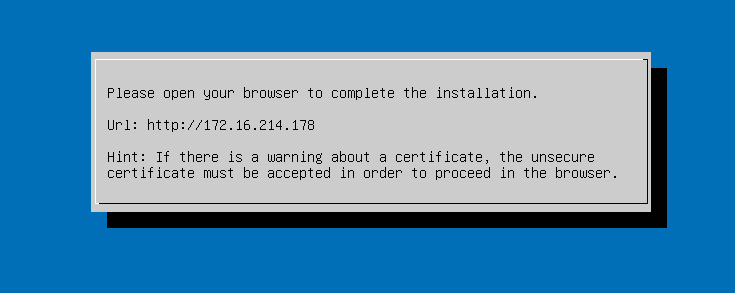




 
**Useful Knowledge**
 
 
 * [pascom Server System Structure]()

 
## pascom Appliance


### Modify your Firewall

Many companies have **no Internet access restrictions** and can therefore **immediately** start using your **pascom appliance** without needing to make any alterations to their Firewall.

However, should you choose to, you can specify which internet services your company network is permitted to access by opening the following ports and allowing the pascom appliance access in order to ensure that your pascom phone system operates optimally:

#### pascom Services

| Port | Host | Description |
| ---- | ---- | ------------ |
| TCP **80**/**443** | my.pascom.net | Access to the pascom licence server + PUSH services |
| TCP **25** | cloudmx1.pascom.net, cloudmx2.pascom.net | Access to the pascom Mailserver |
| UDP **123** | \* | Access to the preferred time server (NTP) |
| UDP **3478** | \* | Access for Video-Functionality |

## pascom Server Installation (Only for new / re-installs)
{}
The pascom appliance is delivered with the pascom phone system server software already pre-installed. Perform the following steps only if you wish to reinstall the system!
{}

### Requirements

* USB stick with a minimum capacity of 8GB
* Free of charge Flash Tool [Rufus](https://rufus.akeo.ie/) (only for Windows)
* pascom Server Software [ISO File](https://www.pascom.net/en/downloads/)
 
### Flash the USB Stick

Connect the USB stick to your compute and start Rufus. Now select the pascom Server ISO file under , select the USB stick via  and finally click the :


### Copy Server-ISO

Now copy the server ISO directly to the USB stick and rename it to **pascom.iso**.

### Variant 1 | Create Configfile

Create the file **setup.json** directly on the USB stick with the following content:

```
{
    "device": "sda",
    "skipWelcome": true,
    "skipDevice": true,
    "skipHostname": true,
    "hostname": "usbsetup",
    "skipNetwork": true,
    "skipStartNetwork": true,
    "skipBrowser": true,
    "skipReboot": true,
    "halt": true,
    "preinst" : {
 
    }
}
```

### Variant 2 | Create unattended Configfile
(***Instead of the configuration file above***)  
It is often not possible to connect a monitor to the pascom appliance. To perform an **unattended** installation without clicking through the setup interface
create the file **setup.json** with the following content, also directly on the USB-Stick

```
{
    "device": "sda",
    "skipWelcome": true,
    "skipHostname": true,
    "skipDevice"; true,
    "hostname": "usbsetup",
    "skipNetwork": true,
    "skipStartNetwork": true,
    "skipBrowser": true,
    "skipReboot": true,
    "halt": true,
    "preinst" : {
        "device": "sda",
        "skipWelcome": true,
        "skipHostname": true,
        "hostname": "pascom-server",
        "skipNetwork": true,
        "network": {
            "interface": "enp1s0",
            "mode": "static",
            "ip": "192.168.100.1",
            "netmask": "255.255.255.0",
            "gateway": "192.168.100.254",
            "dns1": "192.168.100.254",
            "dns2": ""
       }
    }
}
```
**Customizable Parameters:**


|Parameter|Beschreibung|
|---|---|
|preinst - **hostname**| Set the Hostname of your pascom Phonesystem z.B. pascom-server.|
|preinst - network - **mode**| **static:** manually assign IP-Adresses. <br /> **dhcp:** Network Interface automatically receives an IP Adress from your DHCP Server.|
|preinst - network - <br/> **ip, <br/> netmask, <br/> gateway, <br/> dns1 + dns2**|You can assign parameters as soon as you have selected **preinst - network - mode** ***static***. With ***dhcp*** leave the parameters blank **""**.|


### Connect, install and remove the USB stick

The **USB stick** prepared in this way can now be connected directly to the **USB3 port** (rear, blue port). Plug the appliance into screen and power and turn it on. The setup will run automatically. After successful setup, the appliance shuts itself off.

{}
**REMOVE THE USB-STICK NOW!**
{}

Turn the appliance back on and proceed to the next step.

## Connect Appliance


## First System Start

Complete the setup and follow the on-screen instructions until you are directed to switch to your browser and start the setup wizard:



## Start Setup Wizard

Open a browser window and go to your pascom PBX server IP address configured during the first system start. Follow the steps until you can login into the Management Interface:


## Setup Mobile Acces via the Internet (optional)

{}
If you want to use this feature, follow these steps now. Future changes are possible, but will result in changes for your users as aspects such as access to the server via the pascom client will change from a local IP address to a DNS name. 
{}

This step is required should you wish to use the pascom mobile client (iOS/Android) or desktop client to access the local pascom server from "on the go" i.e. outside of the network. 

 * See [Setup Mobile Acces via the Internet]()

## Phone System Setup



An additionnal assistant will help you to finish setting up your phone system and add / invite further users.
Proceed as follows: 

* Via a browser window, login into the pascom server as an Admin
* Click on the  and then enter a name for your phone system
* Follow the setup assistant instructions


