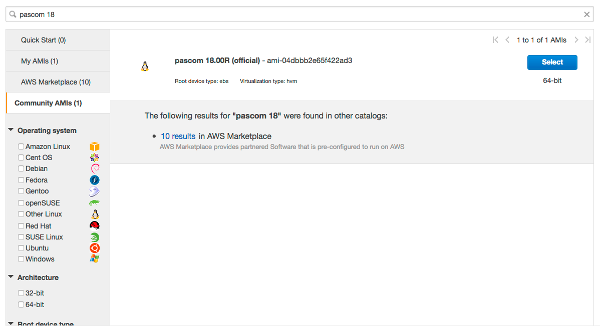
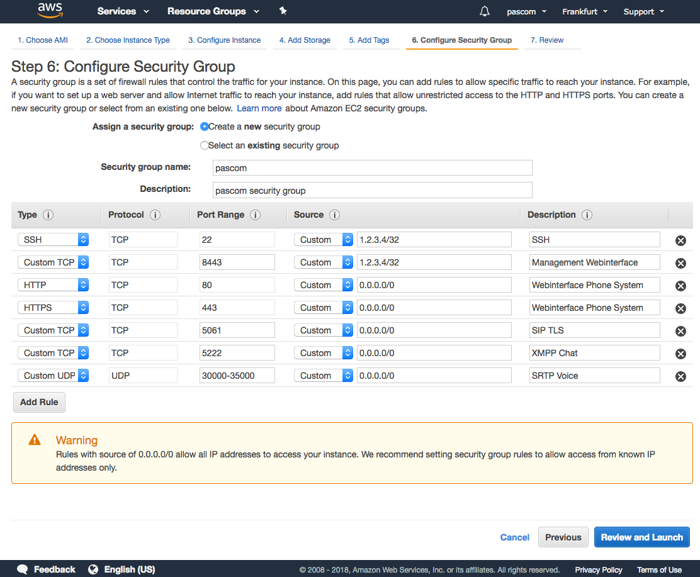

 
 


## Empfohlene AWS Instanzgröße 

|   |< 10 Benutzer|< 50 Benutzer|< 250 Benutzer|< 500 Benutzer|< 1000 Benutzer|
|---|---|---|---|---|---|
|**Instanz Typ1**|t2.small| t2.medium |t2.large| t2.xlarge | t2.2xlarge |
|**EBS Volume2**|32 GB|64 GB|128 GB|256 GB|512 GB|

**1)** Bei hoher CPU-Last empfiehlt sich das Setzen der kostenpflichtigen Option "t2 unlimited". Die Last hängt stark von vom jeweiligen Nutzerverhalten ab. Daher empfehlen wir ohne die Option zu starten und die Instanz über das AWS monitoring zu beobachten. 

**2)** Im Standardfall erzeugt der pascom Server keine hohe IO Last. Daher ist der Volume Typ "magnetic" ausreichend. 

## AWS Instanz Setup

pascom stellt am AWS Standort Frankfurt ein **Community AMI** zur Verfügung:

Fahren Sie mit dem AWS Instanz Setup fort und treffen Sie weiteren Einstellungen laut unseren Empfehlungen bis Sie zum Schritt 6 **Configure Security Group** gelangen.

### Konfiguration der Security Group

#### Management

{}
Auf diese Port müssen Sie als Administrator zugrifen können. Geben Sie diese Ports **keinesfalls** für ungeschrängten Internetzugriff frei. Am einfachsten beschränken Sie hierzu die Quell-IP-Adresse auf den Berich Ihres Unternehens-Netzwerkes. Alternativ können Sie VPN- oder Direkverbindungen der AWS nutzen.
{}

| Port | Beschreibung |
| ---- | ------------ |
| TCP **22** | SSH Server |
| TCP **8443** | Management Webinterface |

#### Telefonieren und Chatten

{}
Für die Nutzung der Telefonie- und Chatservices geben Sie diese Ports für den uneingeschrängten Zugriff über das Internet frei. 
{}

| Port | Beschreibung |
| ---- | ------------ |
| TCP **80**/**443** | Webinterface der Telefonanlage - wichtig für Let's Encrypt Zertifikat |
| TCP **5061** | SIP-TLS - sichere SIP-Kommunikation |
| TCP **5222** | pascom Desktop- und Mobile-Client Zugriffe |
| UDP **30000 - 35000** | SRTP - verschlüsselte Sprachdaten |
| UDP **3478** | Zugriff für Video-Funktionalität |

#### Optionale Dienste

{}
Geben Sie folgende Ports nur dann für die uneingeschrängte Nutzung über das Internet frei wenn Sie diese Dienste auch wiklich verwenden. 
{}

| Port | Beschreibung |
| ---- | ------------ |
| TCP **636** | LDAPS für Telefonbuchzugriffe via LDAP |
| TCP **8884**  | Provisionierung von IP-Hardware-Telefonen |
| TCP **8885**  | VPN Tunnel direkt zur Telefonanlage |

#### Beispielkonfiguration

In dieser Beispielkonfiguration nehmen wir eine fixe Quell-IP-Adresse von **1.2.3.4** zur Absicherung des Managements an: 

### AWS SSH Key Pair

Der pascom Server benötigt **kein** SSH Key Pair der AWS. Wählen Sie deshalb **Proceed without a key pair** und starten die Instanz. Die Passwörter können Sie im Anschluss über das pascom Server Management festlegen.

## pascom Setup Wizard starten

Öffnen Sie einen Browser und surfen auf die AWS IP-Adresse Ihres pascom Servers. Folgen Sie den Anweisungen bis Sie sich am Management Interface anmelden können:

## Domainnamen einrichten

Da nur auf Domainnamen und nicht auf IP-Adressen gültige Zertifikate erstellt werden können müssen Sie zunächst einen Domainnamen für die externe AWS IP-Adresse einrichten.

Sollte Ihnen kein eigener, externer DNS Server zu verfügung stehen bietet [no-ip](https://www.noip.com/) eine einfache Möglichkeit  Domainnamen einzurichten.

## Let's encrypt aktivieren

Der pascom Server in der Lage vollautomatisiert ein Let's Encrypt Certificate für diesen Domainnamen einzurichten. Hierzu sind folgende Schritte notwendig:

* Melden Sie sich per Browser am pascom Server als admin an
* Klicken Sie auf 
* Klicken Sie auf  bei dem von Ihnen verwendeten Interface
* Tragen Sie unter  den zuvor eingerichteten  ein
* Schalten Sie den  auf 
* Durch  wenden Sie die Konfiguration an

Das Interface startet nun neu und bezieht automatisch das Let's Encrypt Certificate. Sollte der Start des Interfaces fehl schlagen prüfen Sie bitte Ihre Firewall-Einstellungen, insbesondere Port TCP 443, und Ihren Domainnamen erneut.

## Telefonanlage einrichten



Ein weiterer Assistent hilft ihnen dabei Ihre Telefonanlage fertig einzurichten und weitere Benutzer anzulegen, bzw. einzuladen.
Gehen Sie hierzu wie folgt vor:

* Melden Sie sich per Browser am pascom Server als admin an
* Klicken Sie auf  und dann auf den Namen Ihrere Anlage
* Folgen Sie den Anweisungen des Assistenten