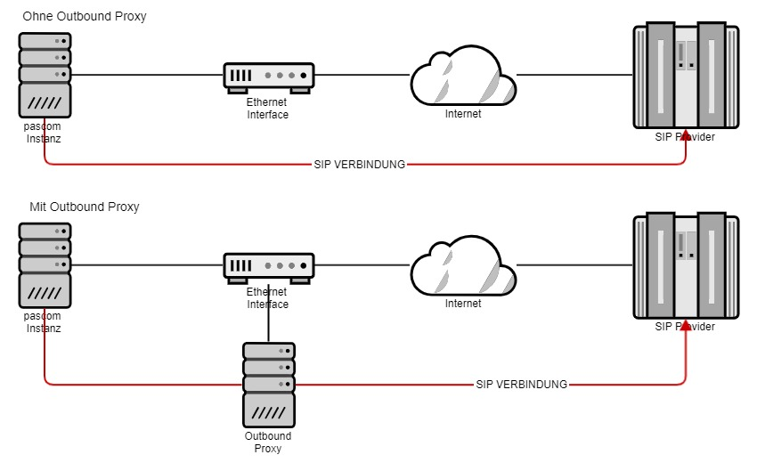
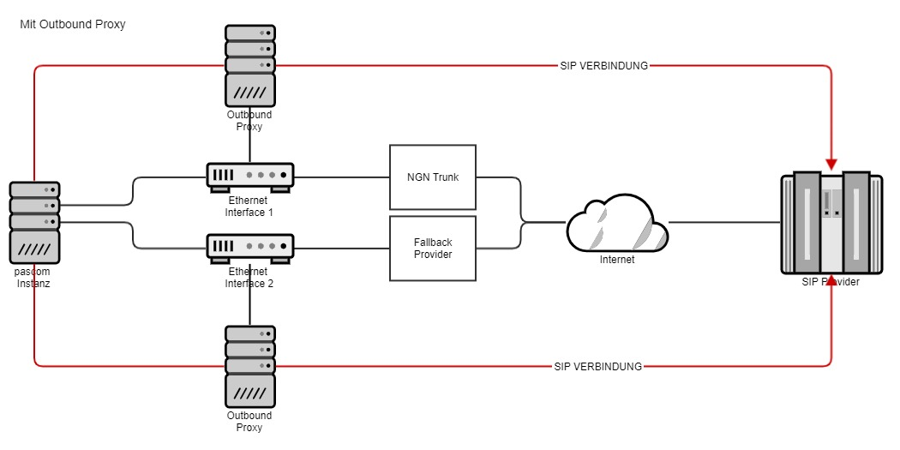





## Konzept

Der Outbound Proxy verwaltet und überwacht Registrierungs- und SIP Pakete zu Ihrem Provider. Zusätzlich optimiert der Outbound Proxy SIP Header mit weiteren Parameter, um ein effizienteres Routing der SIP Datenströme innerhalb der pascom Telefonanlage zu ermöglichen. Dies hat zur Folge, das umständliches NAT Masquerading zur Vergangenheit gehört und dadurch vorallem Nutzer von NGN Trunks provitieren.

Ohne Outbound Proxy spricht die pascom Instanz direkt mit dem SIP Provider und erfordert zusätzlich eine Konfiguration des NAT. Durch Nutzung des Outbound Proxy kümmert sich dieser um die SIP Datenströme und macht so eine Anpassung des NAT überflüssig.

## Nutzung eines NGN Trunks auf separaten Interfaces

Der Outbound Proxy der pascom Telefonanlage sitzt auf den Ethernet Interfaces. Dies erlaubt es, den Outbound Proxy jedem beliebigen Interface zuzuweisen. Somit können Sie die Verbindung zu Ihrem Provider auf einem Interface konfigurieren, während auf dem anderen Interface z.B ein weiterer Provider als Fallback eingerichtet ist.

## Outbound Proxy nutzen

Die Einrichtung des Outbound Proxy ist sehr einfach. In den [Basiseinstellungen]() Ihres Amts unter
 >  >  wählen Sie das entsprechende Interface aus, auf dem der Outbound Proxy aktiv laufen soll.

**Wichtig** Damit die Änderungen wirksam werden, muss der gesamte Host (pascom Anlage) neugestartet werden!

