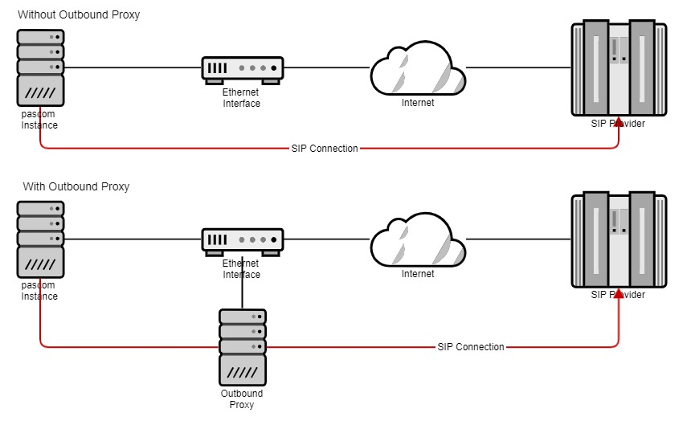
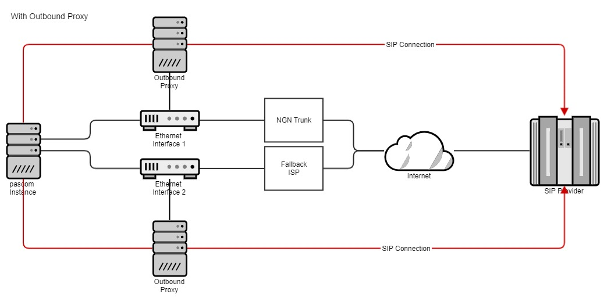





## Concept

The outbound proxy manages and monitors registration and SIP packages to your provider. In addition, the outbound proxy SIP header is optimized with additional parameters to enable more efficient routing of the SIP data streams within the pascom telephone system. As a result, cumbersome NAT masquerading is a thing of the past and thus provokes users of NGN trunks in particular.

Without an outbound proxy, the pascom instance speaks directly to the SIP provider and also requires a configuration of the NAT. By using the outbound proxy, it takes care of the SIP data streams, making it unnecessary to adapt the NAT.

## Use of an NGN trunk on separate interfaces

The outbound proxy of the pascom telephone system is located on the Ethernet interfaces. This allows the outbound proxy to be assigned to any interface. This allows you to configure the connection to your provider on one interface, while another provider, for example, is set up as fallback on the other interface.

## Outbound Proxy usage

Setting up the outbound proxy is very easy. In the [basic settings] () of your Trunks under
> >  select the appropriate interface on which the outbound proxy should run actively.

**Important** For the changes to take effect, the entire host (pascom system) must be restarted!

